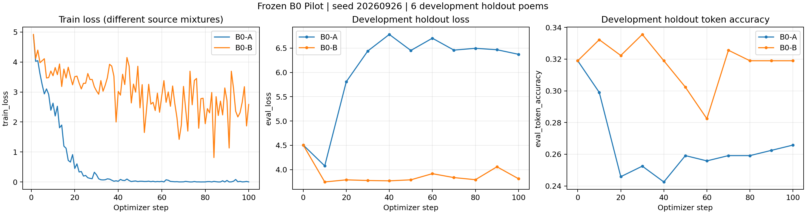

# B0 Pilot 实验结果

严格执行冻结协议 `1169766`：A/B 均完成 100 optimizer steps，没有中途调参或增加步数。训练文件、split、数据与超参数哈希审计通过。

仅有 1 个 split、1 个 seed、6 条 development holdout。这是描述性观察，不是独立 test set 或显著性结论。意象和密度分数是规则代理指标；未调用四个未通过 gate 的语义评分器。

## 第 100 步结果

| 指标 | B0-A | B0-B | Δ(B−A) |
|---|---:|---:|---:|
| eval_loss | 6.372596 | 3.812666 | -2.559929 |
| eval_token_accuracy | 0.265781 | 0.318937 | +0.053156 |
| form_compliance | 1.000000 | 0.333333 | -0.666667 |
| imagery_micro_precision | 0.590909 | 0.600000 | +0.009091 |
| imagery_micro_recall | 0.565217 | 0.130435 | -0.434783 |
| imagery_micro_F1 | 0.577778 | 0.214286 | -0.363492 |
| density_accuracy | 0.666667 | 0.000000 | -0.666667 |
| peak_vram_gib | 3.580305 | 3.580305 | +0.000000 |
| wall_clock_seconds | 830.421520 | 800.479637 | -29.941883 |
| training_seconds | 368.724512 | 373.247412 | +4.522900 |
| processed_tokens | 139171.000000 | 132213.000000 | -6958.000000 |

accuracy / compliance / F1 使用 0–1 比例；VRAM 为 allocated GiB，wall-clock 为秒，包含 Python 导入、模型加载、评估和保存。training_seconds 仅累计训练更新时间。模型已在本地缓存；运行先后造成的 OS 缓存差异可能影响 wall-clock。

## 完整学习曲线



所有 100 个训练 loss 点和 11 个评估点保存在 [CSV](../research/outputs/b0_pilot/learning_curves.csv) 与 [comparison JSON](../research/outputs/b0_pilot/b0_pilot_comparison.json)。原始 JSONL 保留每步来源计数、ID exposure、学习率、token 数和显存。两组 step-0 的 loss、accuracy 和逐条生成完全一致。训练 loss 的数据来源不同，不能把两条 train loss 的差异直接当成同一测试集上的优劣。

## 采样与完整性

- B0-A: 实际来源次数 {'gold': 800}；比例 {'gold': 1.0}。逐条 ID exposure 与预先保存的 800 次采样计划一致。
- B0-B: 实际来源次数 {'gold': 232, 'partial-silver': 568}；比例 {'gold': 0.29, 'partial-silver': 0.71}。逐条 ID exposure 与预先保存的 800 次采样计划一致。
- 两组各保存 10 个 adapter-only checkpoints，包含 step 100；20 个 safetensors 的结构、LoRA keys 与文件 SHA256 均已核验。大文件保存在本地 ignored 目录，Git 保存路径、哈希与大小；不将 base weights 推送到 Git。
- 没有 OOM、NaN/Inf、泄漏 assertion failure 或运行中断。标准库／Transformers 提示保留在 console log。

## 6 条逐诗生成对照

保留原始输出，不做繁简转换、文本润色或人工标签修订。意象 matched/missing/extra 仅对应冻结规则与目标意象的集合比较。

### 1. `tang-0a84422b-f228-4263-8d6f-281b1606d605`

目标控制：`{"form": "qilv7", "emotion": ["joyful", "serene"], "imagery": ["landscape", "flora", "season_weather", "fauna"], "diction": "refined", "expression": "balanced", "energy": "gentle", "density": "dense"}`

参考诗：
```text
百越城池枕海圻
永嘉山水復相依
懸蘿弱篠垂清淺
宿雨朝暾和翠微
鳥訝山經傳不盡
花隨月令數仍稀
幸陪謝客題詩句
誰與王孫此地歸
```

B0-A：
```text
領得溪風不放迴
傍窗緣砌遍庭栽
須招野客爲鄰住
看引山禽入郭來
幽院獨驚秋氣早
小門深向綠陰開
誰憐翠色兼寒影
靜落茶甌與酒杯
```
诗体通过：True；意象 F1：0.5000；密度预测：dense；密度匹配：True。
与本组训练正文完全一致的记录 ID（忽略标点）：`['tang-4e7818af-b432-424d-b011-21180f6e9053']`。
意象命中：`['landscape', 'season_weather']`；缺失：`['fauna', 'flora']`；额外：`['human_culture', 'travel']`。

B0-B：
```text
家在閩山西復西
其中歲歲有鶯啼
如今不在鶯啼處
鶯在舊時啼處啼
```
诗体通过：False；意象 F1：0.0000；密度预测：None；密度匹配：False。
与本组训练正文完全一致的记录 ID（忽略标点）：`['tang-c591cbbd-4b6d-4284-a265-d29ffb1db9b4']`。
意象命中：`[]`；缺失：`['fauna', 'flora', 'landscape', 'season_weather']`；额外：`[]`。

### 2. `tang-599f85c6-76cb-4af5-bc51-67b9c36b2ab4`

目标控制：`{"form": "qijue7", "emotion": ["melancholic"], "imagery": ["frontier", "landscape", "season_weather", "human_culture"], "diction": "refined", "expression": "balanced", "energy": "balanced", "density": "dense"}`

参考诗：
```text
昔年曾逐漢征東
三授兵符百戰中
力保山河嗟下世
秋風牢落故營空
```

B0-A：
```text
破虜功成百戰場
天書新拜漢中郎
映門旌斾春風起
對客弦歌白日長
```
诗体通过：True；意象 F1：0.7500；密度预测：dense；密度匹配：True。
与本组训练正文完全一致的记录 ID（忽略标点）：`[]`。
意象命中：`['frontier', 'human_culture', 'season_weather']`；缺失：`['landscape']`；额外：`['celestial']`。

B0-B：
```text
家在閩山西復西
其中歲歲有鴈啼
如今不在鵲飛處
唯有空巢春寂寂
```
诗体通过：True；意象 F1：0.5714；密度预测：medium；密度匹配：False。
与本组训练正文完全一致的记录 ID（忽略标点）：`[]`。
意象命中：`['landscape', 'season_weather']`；缺失：`['frontier', 'human_culture']`；额外：`['fauna']`。

### 3. `tang-805df95b-c30d-4773-ac47-68f6574f6d81`

目标控制：`{"form": "qilv7", "emotion": ["serene", "joyful"], "imagery": ["human_culture", "flora", "landscape", "fauna"], "diction": "refined", "expression": "balanced", "energy": "gentle", "density": "dense"}`

参考诗：
```text
清邃林亭指畫開
幽巖別派像天台
坐牽蕉葉題詩句
醉觸藤花落酒杯
白鳥不歸山裏去
紅鱗多自鏡中來
終年此地爲吟伴
早起尋君薄暮迴
```

B0-A：
```text
領得溪風不放迴
傍窗緣砌遍庭栽
須招野客爲鄰住
看引山禽入郭來
幽院獨驚秋氣早
小門深向綠陰開
誰憐翠色兼寒影
靜落茶甌與酒杯
```
诗体通过：True；意象 F1：0.5000；密度预测：dense；密度匹配：True。
与本组训练正文完全一致的记录 ID（忽略标点）：`['tang-4e7818af-b432-424d-b011-21180f6e9053']`。
意象命中：`['human_culture', 'landscape']`；缺失：`['fauna', 'flora']`；额外：`['season_weather', 'travel']`。

B0-B：
```text
家在閩山西復西
其中歲歲有鶯啼
如今不在鶯啼處
鶯在舊時啼處啼
```
诗体通过：False；意象 F1：0.0000；密度预测：None；密度匹配：False。
与本组训练正文完全一致的记录 ID（忽略标点）：`['tang-c591cbbd-4b6d-4284-a265-d29ffb1db9b4']`。
意象命中：`[]`；缺失：`['fauna', 'flora', 'human_culture', 'landscape']`；额外：`[]`。

### 4. `tang-95477829-6273-4f85-a0b8-d5bf3c07e507`

目标控制：`{"form": "qilv7", "emotion": ["melancholic"], "imagery": ["flora", "season_weather", "human_culture", "celestial"], "diction": "ornate", "expression": "implicit", "energy": "gentle", "density": "medium"}`

参考诗：
```text
帶露含煙處處垂
綻黃搖綠嫩參差
長堤未見風飄絮
廣陌初憐日映絲
斜傍畫筵偷舞態
低臨粧閣學愁眉
離亭不放到春暮
折盡拂簷千萬枝
```

B0-A：
```text
恰當歲日紛紛落
天寶瑤花助物華
自古最先標瑞牒
有誰輕擬比楊花
密飄粉署光同冷
靜壓青松勢欲斜
豈但小臣添興詠
狂歌醉舞一家家
```
诗体通过：True；意象 F1：0.6667；密度预测：sparse；密度匹配：False。
与本组训练正文完全一致的记录 ID（忽略标点）：`['tang-a0e56e1e-22a7-4afa-8f2b-9da47aff3e0e']`。
意象命中：`['flora', 'human_culture']`；缺失：`['celestial', 'season_weather']`；额外：`[]`。

B0-B：
```text
家在閩山西復西
其中歲歲有鶯啼
如今不在鶯啼處
鶯在舊時啼處啼
```
诗体通过：False；意象 F1：0.0000；密度预测：None；密度匹配：False。
与本组训练正文完全一致的记录 ID（忽略标点）：`['tang-c591cbbd-4b6d-4284-a265-d29ffb1db9b4']`。
意象命中：`[]`；缺失：`['celestial', 'flora', 'human_culture', 'season_weather']`；额外：`[]`。

### 5. `tang-c8f4ef3d-dfd7-4d77-8d4c-df0e8575eeef`

目标控制：`{"form": "qijue7", "emotion": ["melancholic"], "imagery": ["landscape", "flora", "travel"], "diction": "plain", "expression": "direct", "energy": "balanced", "density": "medium"}`

参考诗：
```text
處處看山不可行
野花相向笑無成
長嫌爲客過州縣
漸被時人識姓名
```

B0-A：
```text
木葉紛紛湘水濱
此中何事往頻頻
臨風自笑歸時晚
更送浮雲逐故人
```
诗体通过：True；意象 F1：0.5714；密度预测：medium；密度匹配：True。
与本组训练正文完全一致的记录 ID（忽略标点）：`['tang-3dc2c19f-a20a-4405-b4e7-5a1b2f75cf03']`。
意象命中：`['flora', 'travel']`；缺失：`['landscape']`；额外：`['celestial', 'season_weather']`。

B0-B：
```text
家在閩山西復西
其中歲歲有鶯啼
如今不在鶯啼處
鶯在舊時啼處啼
```
诗体通过：True；意象 F1：0.4000；密度预测：sparse；密度匹配：False。
与本组训练正文完全一致的记录 ID（忽略标点）：`['tang-c591cbbd-4b6d-4284-a265-d29ffb1db9b4']`。
意象命中：`['landscape']`；缺失：`['flora', 'travel']`；额外：`['fauna']`。

### 6. `tang-fe589d8b-6a1f-4a8f-9a91-89c870603419`

目标控制：`{"form": "qijue7", "emotion": ["heroic"], "imagery": ["human_culture", "landscape", "travel", "celestial"], "diction": "refined", "expression": "direct", "energy": "vigorous", "density": "sparse"}`

参考诗：
```text
九重天子人中貴
五等諸侯閫外尊
爭似布衣雲水客
不將名字挂乾坤
```

B0-A：
```text
木葉紛紛湘水濱
此中何事往頻頻
臨風自笑歸時晚
更送浮雲逐故人
```
诗体通过：True；意象 F1：0.5000；密度预测：medium；密度匹配：False。
与本组训练正文完全一致的记录 ID（忽略标点）：`['tang-3dc2c19f-a20a-4405-b4e7-5a1b2f75cf03']`。
意象命中：`['celestial', 'travel']`；缺失：`['human_culture', 'landscape']`；额外：`['flora', 'season_weather']`。

B0-B：
```text
破虜功成百戰場
天書新拜漢中郎
映門旌斾春風起
對客弦歌白日長
階下鬬雞花乍發
營南試馬柳初黃
由來吳楚多同調
感激逢君共異鄉
```
诗体通过：False；意象 F1：0.0000；密度预测：None；密度匹配：False。
与本组训练正文完全一致的记录 ID（忽略标点）：`['tang-7887d2d9-3655-45b1-a556-349d95304058']`。
意象命中：`[]`；缺失：`['celestial', 'human_culture', 'landscape', 'travel']`；额外：`[]`。

## 描述性解释

Observed gain：B 相对 A 的 eval loss 降低 2.5599，token accuracy 提高 5.32 个百分点。但 B 的最终 token accuracy 与共同 step-0 的 31.89% 相同，因此不能表述为相对 pretrained baseline 的 token accuracy 提升。

Observed degradation：诗体合规 6/6 → 2/6，意象 micro-F1 0.5778 → 0.2143，密度匹配 4/6 → 0/6。按冻结协议，诗体失败的输出记为空意象/null 密度，因此意象和密度下降也包含诗体失败的影响。

A 的训练 loss 几乎归零，同时 holdout loss 高于起点，符合小样本过拟合的迹象。A/B 分别只有 4/3 个不同生成文本，两组均有 5/6 条输出与本组训练正文完全一致（忽略标点）；B 有 4 条输出复用同一首七绝，且其中 3 条目标是七律，另有一条七绝目标输出了八句。这些是文本与句数观察，不是自动语义质量评分。

当前不建议把 B 当成成功改进直接扩大 multi-seed 训练。优先利用已保存产物分析重复训练诗输出和诗体条件失效；若之后要判断这些现象是否稳定，可另行开展小规模 multi-seed replication。本轮没有证明 B 优于 A，也没有继续训练。


## 验证

`pytest tests/ -q`：170 passed, 1 warning in 126.30s (0:02:06)。`git diff --check` 通过。没有修改任何冻结训练文件；仅新增计时、结果汇总、绘图及其测试。

曲线由 Matplotlib 3.10.8 生成；绘图依赖安装日志保存在 outputs/b0_pilot/plot_dependency_install.log。该安装没有更新 Torch、NumPy、Transformers 或 PEFT。总耗时使用 perf_counter 单调计时器记录。
